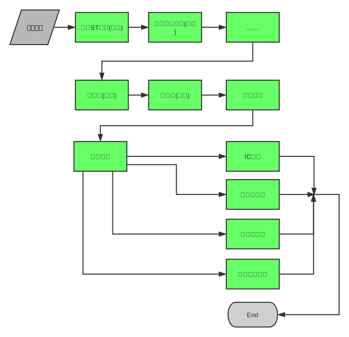

### 简介

csf-factors主要用来进行多因子模型的创建与分析，实现了数库科技Factors（http://factors.ichinascope.com）量化平台的因子分析及多因子策略回测的功能。所运用的数据来自数库量化SDK（http://developer.ichinascope.com/docs/base/pythonsdk)。

### 特色
1. 容易使用: 本项目将多因子分析抽象成一个管道(pipeline).原始数据通过这些管道, 最终生成
多因子分析的报告.



### 安装

pip install csf-factors


### 说明

多因子量化选股策略主要由以下几个步骤：

1. 数据获取：因子数据、股票收益率数据、停复牌数据等
2. 单因子分析：IC分析、收益率分析
3. 多因子组合：因子打分、因子组合分析
4. 回测：精细化回测，考虑张跌停、停牌、次新股等因素

各主要模块说明：

1. data.py: 数据模块，通过csf模块获取数据
2. analysis.py：分析模块，主要包含单因子分析各步骤的主要函数，包括原始数据处理、IC计算等
3. metrics.py：指标模块，包含多种收益率度量的指标，如最大回撤，夏普比率等
4. plot.py：作图模块，IC分析、收益率分析等作图，图表类型与factors量化平台类似
5. single_factor_analysis：单因子分析接口
6. multiple_factor_analysis：多因子分析接口


### 使用示例

```python
from factors.analysis import (filter_out_recently_ipo,
                                filter_out_suspend,
                                filter_out_st,
                                return_analysis,
                                standardize)
from factors.analysis import (information_coefficient_analysis,
                              code_analysis,
                              turnover_analysis)
from factors.analysis import prepare_data, add_group, de_extreme
from factors.multiple_factor_analysis import score, multiple_factors_analysis
import csf

a_key = '此处为AccessKey'
s_key = '此处为SecretKey'
csf.config.set_token(a_key,s_key) 

# 准备数据
data = prepare_data(factor_name=["M004009Y", 'M008005'],
                    index_code='000300',
                    benchmark_code='000300',
                    start_date='2013-01-01',
                    end_date='2016-01-01', freq='M')

# 定义分析流程
pipeline = [filter_out_st, filter_out_suspend, filter_out_recently_ipo,de_extreme, standardize,
            score,
            add_group,
            (information_coefficient_analysis, return_analysis, code_analysis, turnover_analysis)]
# 给定相关参数
params = {'de_extreme': {'num': 1, 'method': 'mad'},
          'standardize': dict(method='cap'),
          'return_analysis': dict(plot=True),
          }

# 调用多因子分析接口
result = multiple_factors_analysis(data, pipeline, params)
```

